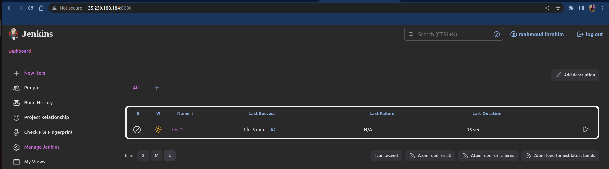

# ITI-Graduation-Project-Infrastructure
Create GKE using Terraform infrastructure and jenkins deployment to
Deploy a Python web application on GKE using CI/CD Jenkins Pipeline using the following steps and high-level diagram:
1. Implement a secure GKE Cluster
2. Deploy and configure Jenkins on GKE
3. Deploy the backend application on GKE using the Jenkins pipeline

## Project Chart


### Used Tools
 
 - Terraform          
Infrastructure as a code to execute the app Infrastructure.


 - Jenkins            
An open source automation server which we will use to build, test, and deploy our app or software.


 - Docker             
 The platform which we use to build the app image.


 - Ansible            
provision the underlying infrastructure of your environment, virtualized hosts and hypervisors.


 - Kubernates         
 Kubernetes automates operational tasks of container management.


 - GCP                
The Google cloud provider which we will use it through our project.

### provision infrastructure using terraform
```
terraform init
```
```
terraform plan
```
```
terraform apply
```


### Install kubectl & Ansible in VM instance with automatic script and run the ansible playbook
```
metadata_startup_script = <<-EOF
                                    #
                                    sudo apt install -y apt-transport-https ca-certificates gnupg
                                    echo "deb [signed-by=/usr/share/keyrings/cloud.google.gpg] https://packages.cloud.google.com/apt cloud-sdk main" | sudo tee -a /etc/apt/sources.list.d/google-cloud-sdk.list
                                    curl https://packages.cloud.google.com/apt/doc/apt-key.gpg | sudo tee /usr/share/keyrings/cloud.google.gpg
                                    sudo apt-get update && sudo apt-get install -y google-cloud-cli
                                    sudo apt-get install kubectl -y
                                    sudo apt-get install google-cloud-sdk-gke-gcloud-auth-plugin -y
                                    sudo git clone https://github.com/mahmoud-24/ITI-Graduation-Project-Infrastructure /home/mahmoud/ans-file
                                    sudo apt-get install -y ansible
                                    sudo ansible-playbook /home/mahmoud/ans-file/ansible.yaml
                                 EOF
```
### Ansible playbook Tasks


## Jenkins link : http://35.230.188.184:8080


### Get Jenkins Password Connect To VM
```
kubectl exec --namespace jenkins -it svc/jenkins-service -c jenkins -- /bin/cat /var/jenkins_home/secrets/initialAdminPassword && echo
```


